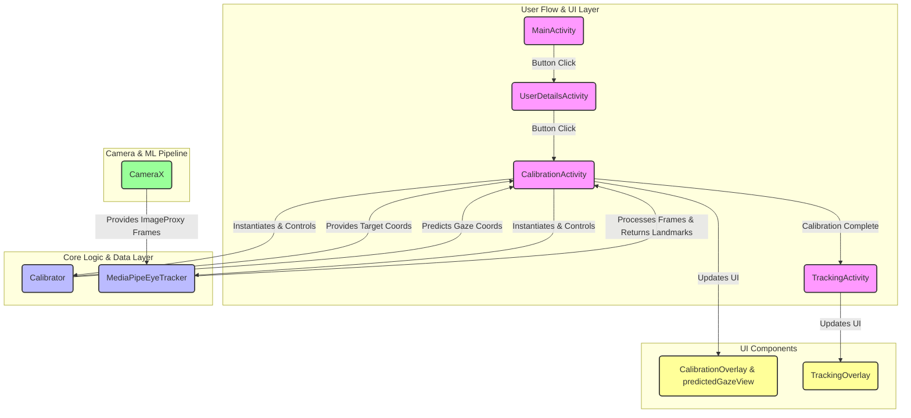

# KotlinApp Codebase Technical Overview

This document provides a comprehensive analysis of the structure, function, and interconnections of the Kotlin and XML files within the eye-tracking application codebase.

## Files Overview

### Kotlin Files
| File Path | Purpose | Key Classes/Functions | Connected Files |
|-----------|---------|----------------------|----------------|
| `CalibrationActivity.kt` | Orchestrates the entire 25-point eye-tracking calibration process, handling camera setup, UI updates, and user interaction. | `CalibrationActivity`, `onFaceLandmarkerResult()` | `activity_calibration.xml`, `MediaPipeEyeTracker.kt`, `Calibrator.kt`, `EyeFeatureExtractor.kt`, `TrackingActivity.kt` |
| `CalibrationOverlay.kt` | A custom `View` responsible for drawing the red calibration target circle on the screen. | `CalibrationOverlay`, `updateCalibrationPoint()`, `onDraw()` | `activity_calibration.xml`, `CalibrationActivity.kt` |
| `Calibrator.kt` | Core logic class that manages the calibration data, trains the regression model (OLS), and predicts gaze coordinates. | `Calibrator`, `CalibrationMatrix`, `add()`, `predict()` | `CalibrationActivity.kt`, `TrackingActivity.kt` |
| `EyeFeatureExtractor.kt` | A utility object to process raw MediaPipe landmark data into a feature vector for the regression model and calculate 6 key eye metrics. | `EyeFeatureExtractor`, `extractFeatures()` | `CalibrationActivity.kt`, `TrackingActivity.kt` |
| `Fixation.kt` | A helper class ported from the JavaScript version to detect and quantify gaze fixation. | `Fixation`, `process()` | _Currently unlinked_ |
| `ImageUtils.kt` | A utility object containing helper functions, primarily to convert CameraX `ImageProxy` objects to `Bitmap`. | `ImageUtils`, `toBitmap()` | _Currently unlinked_ |
| `MainActivity.kt` | The application's main entry point. Its sole purpose is to launch the user details collection screen. | `MainActivity` | `activity_main.xml`, `UserDetailsActivity.kt` |
| `MediaPipeEyeTracker.kt` | A wrapper that abstracts the setup and execution of the MediaPipe `FaceLandmarker` task, processing camera frames and returning results. | `MediaPipeEyeTracker`, `processFrame()` | `CalibrationActivity.kt`, `TrackingActivity.kt` |
| `TrackingActivity.kt` | The post-calibration screen designed to display the camera feed and overlay the user's real-time predicted gaze. | `TrackingActivity` | `activity_tracking.xml`, `MediaPipeEyeTracker.kt`, `Calibrator.kt`, `TrackingOverlay.kt` |
| `TrackingOverlay.kt` | A custom `View` used to draw the user's predicted gaze (a green circle and crosshairs) on the `TrackingActivity` screen. | `TrackingOverlay`, `updateGaze()`, `onDraw()` | `activity_tracking.xml`, `TrackingActivity.kt` |
| `UserDetailsActivity.kt` | A pre-calibration screen that collects the user's age and gender before proceeding. | `UserDetailsActivity` | `activity_user_details.xml`, `CalibrationActivity.kt` |

### XML Files
| File Path | Purpose | Key Elements | Connected Files |
|-----------|---------|--------------|----------------|
| `layout/activity_main.xml` | Defines the layout for the app's entry screen. | `Button` (`@+id/btnStartCalibration`) | `MainActivity.kt` |
| `layout/activity_user_details.xml`| Defines the layout for collecting user age and gender. | `EditText` (`@+id/etAge`), `RadioGroup` (`@+id/rgGender`) | `UserDetailsActivity.kt` |
| `layout/activity_calibration.xml`| Defines the layout for the calibration screen. | `PreviewView`, `CalibrationOverlay`, `View` (`@+id/predictedGazeView`) | `CalibrationActivity.kt` |
| `layout/activity_tracking.xml` | Defines the layout for the real-time gaze tracking screen. | `PreviewView`, `TrackingOverlay` | `TrackingActivity.kt` |
| `drawable/gaze_dot.xml` | Defines the appearance (blue circle with white border) of the predicted gaze view. | `<shape>` | `activity_calibration.xml` |
| `drawable/*.xml` | Provide styling for UI components like backgrounds and buttons. | `<shape>`, `<vector>` | Various layout XMLs |
| `values/strings.xml` | Centralizes user-facing strings for easy management and localization. | `<string>` | Various Kotlin & XML files |
| `values/colors.xml` | Defines the application's color palette. | `<color>` | Various Kotlin & XML files |
| `values/themes.xml` | Defines the base visual style and theme for the application. | `<style>` | `AndroidManifest.xml` |

## Interconnections and Dependencies

The application follows a linear, multi-activity flow. The core logic is centered around the `CalibrationActivity`, which integrates the camera, machine learning, and UI components.

- **Application Flow**:
    1.  `MainActivity` (`activity_main.xml`) -> Launches `UserDetailsActivity`.
    2.  `UserDetailsActivity` (`activity_user_details.xml`) -> Collects data and launches `CalibrationActivity`.
    3.  `CalibrationActivity` (`activity_calibration.xml`) -> Performs the calibration. On success, it launches `TrackingActivity`.
    4.  `TrackingActivity` (`activity_tracking.xml`) -> Displays the final real-time gaze tracking.

- **Key Component Relationships**:
    - **Activity-Layout Binding**: Each Activity (`MainActivity`, `UserDetailsActivity`, etc.) uses View Binding to inflate its corresponding XML layout (`activity_main.xml`, `activity_user_details.xml`).
    - **Camera to MediaPipe**: `CalibrationActivity` and `TrackingActivity` use CameraX to get a live frame feed. Each frame is passed to `MediaPipeEyeTracker`.
    - **MediaPipe to Logic**: `MediaPipeEyeTracker` processes the frame and returns a `FaceLandmarkerResult` to the calling Activity.
    - **Logic to UI**: The Activity uses `EyeFeatureExtractor` to get a feature vector, passes it to `Calibrator` to get a predicted gaze coordinate, and then updates the UI (`predictedGazeView` and `CalibrationOverlay`) on the main thread.

## Issues and Notes

- **Unlinked Files**: The following Kotlin files exist in the codebase but are not currently called or referenced by any of the primary Activity flows. They may be remnants of previous development or intended for future features.
- `Fixation.kt`: This class is a direct Kotlin port of `fixation.js` from the JavaScript reference project. However, its `process()` method is never called. The current fixation/stability logic is handled directly within `CalibrationActivity`.
- `ImageUtils.kt`: This utility object for converting an `ImageProxy` to a `Bitmap` is not currently in use. The application passes the `ImageProxy` directly to the MediaPipe task library, which is more efficient.
